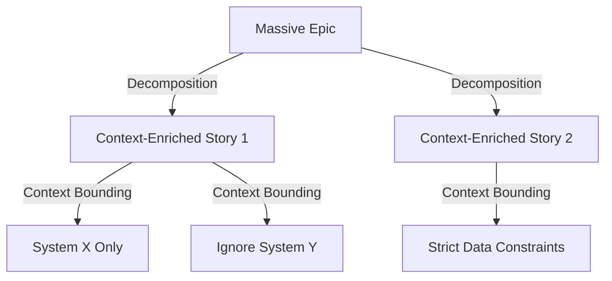

# Module 3: Decomposition (Token Tracking)

## Theory: Story Slicing by Context
In traditional Agile, Requirements Leads slice stories so a team can finish them in 2 weeks. 
In AI Agile, you slice stories so an LLM can parse them in **under 50k tokens**. 

If a User Story requires the AI to read 15 files across 4 microservices to understand the contract, you have failed the decomposition. 

### The Decomposition and Bounding Process

## Verbose Example
**Story:** "Full Dashboard implementation (API, DB, UI)."

**Contextual AI Slicing:**
* **Story A:** "Schema & Database Migration for Dashboard Data." (AI context: Only the `db/migrations/` directory).
* **Story B:** "REST API Endpoints for Dashboard." (AI context: Only the `src/controllers/` and Story A's output schema).
* **Story C:** "React Frontend for Dashboard." (AI context: Only `src/components/` and the Mock API definitions).

## Exercise: Slice by Context, not Time

**Scenario:** Building a "Password Reset" flow.

**Your Action:**
Slice this down into token-isolated user stories. 

1. **Story 1 (Backend Token Generaton):** [What files does the AI need?]
2. **Story 2 (Email Dispatch):** [What files does the AI need?]
3. **Story 3 (Frontend Form):** [What files does the AI need?]

---
[**Next Module: Semantic Context Engineering →**](./04_context_engineering.md)
