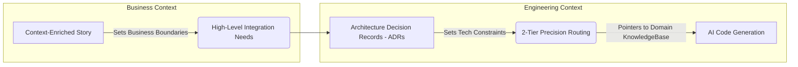

# Builder Hub: Architecting the Sandbox

## 🎯 The Builder's Goal
Your objective is to build **Deterministic Software** using **Stochastic Tools**. You do this by creating the "Hands" (Function Registries) and the "Navigation" (2-Tier Precision Routing) that allow an AI to traverse a massive repository without token exhaustion.

**Key Resource:** [**The Builder Reference Architecture (Context-First Repo Structure)**](./REFERENCE_ARCHITECTURE.md)

---

## 🤝 The Context Handshake

| Inbound | Role Action | Outbound |
| :--- | :--- | :--- |
| **Context-Enriched User Story** | **Context Engineering** | **Validated Code & Traceable ADRs** |
| (Semantic Requirements) | (Tool & Memory Setup) | (Architecturally Sound Output) |

### From Requirements to Engineering Flow

---

## 🛤️ Training Modules

### 1. Foundation
*   [**Reference Architecture: The Context-First Repo**](./REFERENCE_ARCHITECTURE.md)
    *   Where truth lives in a 500k LOC codebase.

### 2. Implementation Modules
4.  [**Module 4: Context Engineering (The Hands)**](./04_context_engineering.md)
    *   Building Function Registries.
5.  [**Module 5: Context Chaining & Codebase Routing**](./05_context_chaining_and_routing.md)
    *   Literal Python/Bash orchestration for prompt assembly.
6.  [**Module 6: 2-Tier Precision Routing Architecture**](./06_information_routing_structure.md)
    *   Implementing Global Instruction and Domain Context Ingestion.

### 3. Hands-Hands Application
*   [**Lab Workbook: Registries, Chaining, & Routing**](./LAB_WORKBOOK.md)
    *   Physical exercise in creating a 1-hop routing chain.

---

[**Proceed to Module 4: Context Engineering (The Hands) →**](./04_context_engineering.md)
