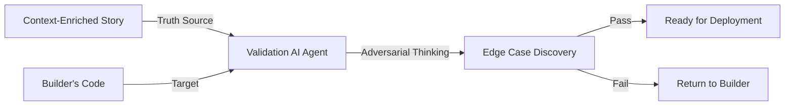

# Validation Lead Hub: Validating the Boundary

## 🎯 The Validation Lead's Goal
Your objective is **Shift-Left Contract Validation**. You ensure the AI doesn't "grade its own homework" by providing the source of truth *before* the code is written.

**Key Resource:** [**The Validation Lead Test Architecture (Adversarial Lab)**](./TEST_ARCHITECTURE.md)

---

As a Validation Lead (Validation Lead), you are the "Validator" of the Context Factory. Your job is to ensure the AI Agent didn't just write code that "works," but code that strictly adheres to the **context-enriched story**. 

## 🤝 The Context Handshake

| Inbound | Role Action | Outbound |
| :--- | :--- | :--- |
| **Code & context-enriched story Contract** | **Adversarial Validation** | **Verified Traceability** |
| (Builder & Requirements Lead Output) | (Red-Teaming & Testing) | (Hallucination-Free Deployment) |

### The Validation Red-Teaming Loop

---

## 📚 Learning Path

Follow these modules in order to learn how to test AI-generated code against architectural contracts.

### 1. Theory Modules
1.  [**Module 1: The 3-Part Directive**](./01_3_part_directives.md)
    *   Forcing the AI to write tests based on the Contract, not the Code.
2.  [**Module 2: Adversarial Thinking**](./02_adversarial_thinking.md)
    *   Writing "Toxic Prompt" tests to ensure the AI follows the constitution.
    *   **Resource:** [Master Skills Template Hub](../templates_and_resources/README.md)
3.  [**Module 3: Contract-First Validation**](./03_decomposition.md)
    *   Ensuring your automated tests fit in a single AI execution window.
4.  [**Module 4: Context Engineering (Audit Trails)**](./04_context_engineering.md)
    *   Orchestrating the trace back to the Epic and Blueprint.

### 2. Hands-On Application
*   [**Lab Workbook: Adversarial Red-Teaming & Contracts**](./LAB_WORKBOOK.md)
    *   Apply all 4 modules to test an agent's output in this repo.

---

## 🏁 The Finish Line
Once you have completed the Lab Workbook, you are ready to see how your validations are orchestrated into an agent.
*   [**Phase 4: Agent Orchestration & Assembly**](../09_ai_agent_orchestration/01_anatomy_of_an_agent.md)
